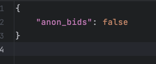
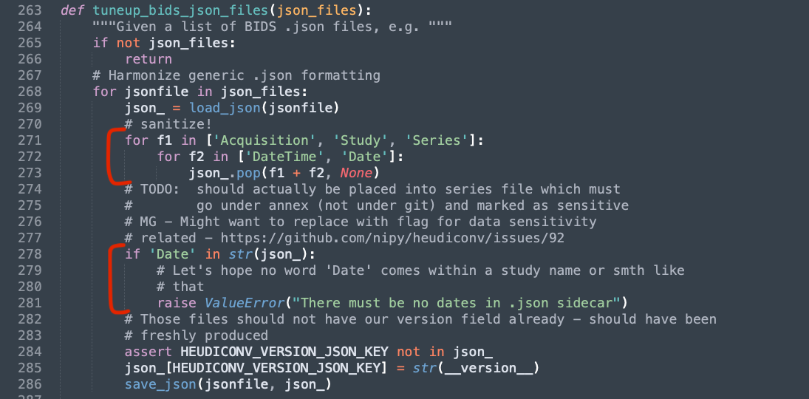
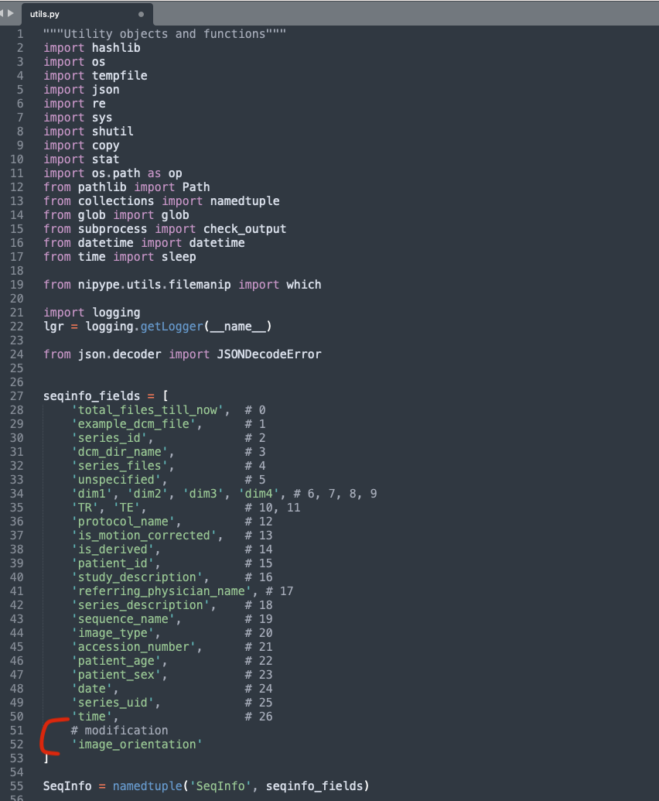
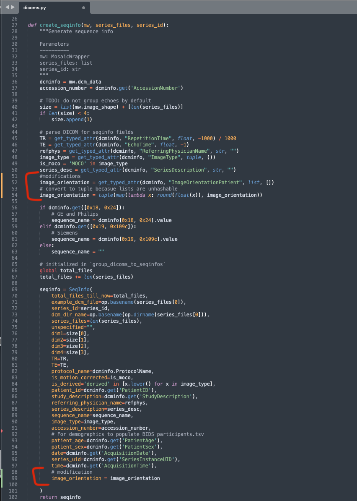

# BIDS TOOLS
* Scripts to organize 9.4T data and videos into BIDS format
* The data from the dicom server is downloaded as a zipped file containing all the data in dcm format
* The data (after unzipping it) is usually organized as follow:

```
DICOM
└── 20221119
    └── Menon^AS-MBN^^^^
        └── 20221119_01.A002D22
            ├── 17001
            │   └── Menon^AS-MBN^^^^.MR.Menon^AS-MBN.17001.1.20221119.7BAD6A76.dcm
            ├── 17002
            │   └── Menon^AS-MBN^^^^.MR.Menon^AS-MBN.17002.1.20221119.FFC1FD2B.dcm
            ├── 18001
            │   └── Menon^AS-MBN^^^^.MR.Menon^AS-MBN.18001.1.20221119.CEE9FC56.dcm
            ├── 18002
            │   └── Menon^AS-MBN^^^^.MR.Menon^AS-MBN.18002.1.20221119.672ABE33.dcm
            ├── 19001
            │   └── Menon^AS-MBN^^^^.MR.Menon^AS-MBN.19001.1.20221119.75D4BDB3.dcm
            ├── 19002
            │   └── Menon^AS-MBN^^^^.MR.Menon^AS-MBN.19002.1.20221119.60725C8A.dcm
            ├── 20001
            │   └── Menon^AS-MBN^^^^.MR.Menon^AS-MBN.20001.1.20221119.28625D6F.dcm
            ├── 20002
            │   └── Menon^AS-MBN^^^^.MR.Menon^AS-MBN.20002.1.20221119.794EF2FF.dcm
            ├── 21001
            │   └── Menon^AS-MBN^^^^.MR.Menon^AS-MBN.21001.1.20221119.0A900199.dcm
            ├── 21002
            │   └── Menon^AS-MBN^^^^.MR.Menon^AS-MBN.21002.1.20221119.F4DD181B.dcm
            ├── 22001
            │   └── Menon^AS-MBN^^^^.MR.Menon^AS-MBN.22001.1.20221119.34A371B7.dcm
            └── 5001
                └── Menon^AS-MBN^^^^.MR.Menon^AS-MBN.5001.1.20221119.BF04DF23.dcm
```
**To run the DICOM to BIDs conversion, simply run the dcm2bids.sh script with the necessary arguments. It takes the zipped file, animal id, session no, type of fmri data (if any), output dir, and a heuristic file**


Example:
```
>>> ./dcm2bids.sh \
-z /Users/aeed/Documents/Work/bids_tools/2.16.756.5.5.200.8323328.47756.1669482679.1142.zip   \
-i 10_389629_F  \
-s s1 \
-t rest \
-d /Users/aeed/Documents/Work/bids_tools \
-f heuristic_9T_rest_awake.py
```

**The heuristic files are tailored towards different projects, but it is easy to modify for a new project.**

**The preferred animal id is: EarPunchNo_CageNo_Gender e.g. 10_389629_F. The EarPunch no gets zeropadded to be 3 digits.**

**The final subject name will be: sub-010389629F.**

### The bids output will look like:
```
sub-010389629F/
└── ses-s1
    ├── anat
    │   ├── sub-0010389629F_ses-s1_run-001_T2w.json
    │   └── sub-0010389629F_ses-s1_run-001_T2w.nii.gz
    ├── fmap
    │   ├── sub-0010389629F_ses-s1_B0MAP.json
    │   └── sub-0010389629F_ses-s1_B0MAP.nii.gz
    ├── func
    │   ├── sub-0010389629F_ses-s1_task-rest_run-001_bold_magnitude_R.json
    │   ├── sub-0010389629F_ses-s1_task-rest_run-001_bold_magnitude_R.nii.gz
    │   ├── sub-0010389629F_ses-s1_task-rest_run-001_bold_magnitude_RV.json
    │   ├── sub-0010389629F_ses-s1_task-rest_run-001_bold_magnitude_RV.nii.gz
    │   ├── sub-0010389629F_ses-s1_task-rest_run-002_bold_magnitude_R.json
    │   ├── sub-0010389629F_ses-s1_task-rest_run-002_bold_magnitude_R.nii.gz
    │   ├── sub-0010389629F_ses-s1_task-rest_run-002_bold_magnitude_RV.json
    │   ├── sub-0010389629F_ses-s1_task-rest_run-002_bold_magnitude_RV.nii.gz
    │   ├── sub-0010389629F_ses-s1_task-rest_run-003_bold_magnitude_R.json
    │   ├── sub-0010389629F_ses-s1_task-rest_run-003_bold_magnitude_R.nii.gz
    │   ├── sub-0010389629F_ses-s1_task-rest_run-003_bold_magnitude_RV.json
    │   └── sub-0010389629F_ses-s1_task-rest_run-003_bold_magnitude_RV.nii.gz
    └── sub-0010389629F_ses-s1_scans.tsv
```

- Whenever you are missing some nii files after conversion, always check if the dicom folders have the right names (41003) instead of (41001) for example
- if this is the case, rename these folders correctly and them to fix_dcm_folders_suffix.sh

- the Acq date and other personal information are omitted by default from json files. In dcm2niix, you just have to add "-ba n" and you will have all the details
- For heudiconv, you need to define a dcmconfig json file and use the flag "--dcmconfig config_file.json" to use it, the fields of the json files comes from nipype wrapper of the dcm2niix converter.
- To remove the anonmyity from the json files in heudiconv, you have to set "anon_bids" to "false" in the dcmconfig.json file to pass the "-ba" flag to dcm2niix

    
- However, there is a function in bids.py called "tuneup_bids_json_files" to override that and remove any dates from the json files.
- if you try to use this flag, it will return this error ``ValueError("There must be no dates in .json sidecar")
ValueError: There must be no dates in .json sidecar``
- So, you have to comment that out in the `bids.py` file to keep the dates in the json files.


- To add an extra field in the dcminfo.tsv file such as the image_orientation, you have:
  - first, to add one more element to the seqinfo_fields in the utils.py file
  
  - second, you need to add this field in dicoms.py file
  
  
- Always, keep track of how many nii are generated and compare them to the dicom server to make sure not files are missing:
```bash
for folder in /Users/aeed/Documents/Work/BIDS/Menon^AS-MBN/sub*; do
    echo $folder; 
    ls ${folder}/*/*/*.json 2>/dev/null | wc -l; 
done
